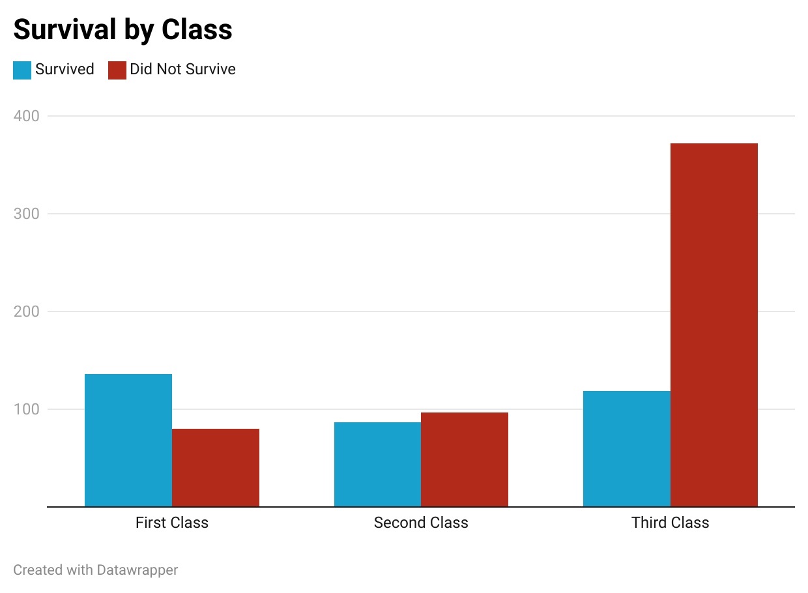

# Titanic-Passengers-Data
This is a Repository created for Professor Gotzler's English 105 Class at UNC Chapel Hill.
## Contents
- This repository contains a [.csv file](train.csv) that contains a dataset of real Titanic Passengers.

  *Note that the dataset does not contain **all** Titanic Passengers*
  
- This Repository also contains a [Python Notebook](TitanicSurvival.ipynb) with instructions on creating a subset of this data.
## About the Data
- The data in the train.csv file was created to be used in a [machine learning competition](https://www.kaggle.com/competitions/titanic/overview) on the website, Kaggle. 
- The dataset that I used is a subset of 891 passengers containing information about them such as name, age, sex, ticket class, etc. it also includes whether or not they survived.
- In this competition, participants create a machine learning model that can predict survival outcomes of other passengers. To train their model, participants will use patterns found in the train.csv file. The participants would then test their model on a different subset of passengers (not included in this repository) that doesn't contain survival outcomes. The participants compete to create the most accurate predictions.
## Purpose
- This repository explores some simple ways to analyze the data from the [train.csv](train.csv) file and look for patterns.
- This data and similar data could be helpful to anyone participating in the [Titanic Machine Learning Competition](https://www.kaggle.com/competitions/titanic/overview).
  - Note that even though this is data about real Titanic passengers, it's not the best source for those looking to learn statistics about *all* Titanic passengers.
- The repository also contains instructions on using Python and Pandas in the [Python Notebook](TitanicSurvival.ipynb) to create subsets and learn more about your data. These techniques and strategies can be applied to other datasets as well.

## Visualization
- The bar graph below shows the rates of survivals and deaths grouped by class.
- The data used in this graph was collected through the process described and demonstrated in this [Python Notebook](TitanicSurvival.ipynb).

The above data visualization was made using [Datawrapper](https://www.datawrapper.de/)
